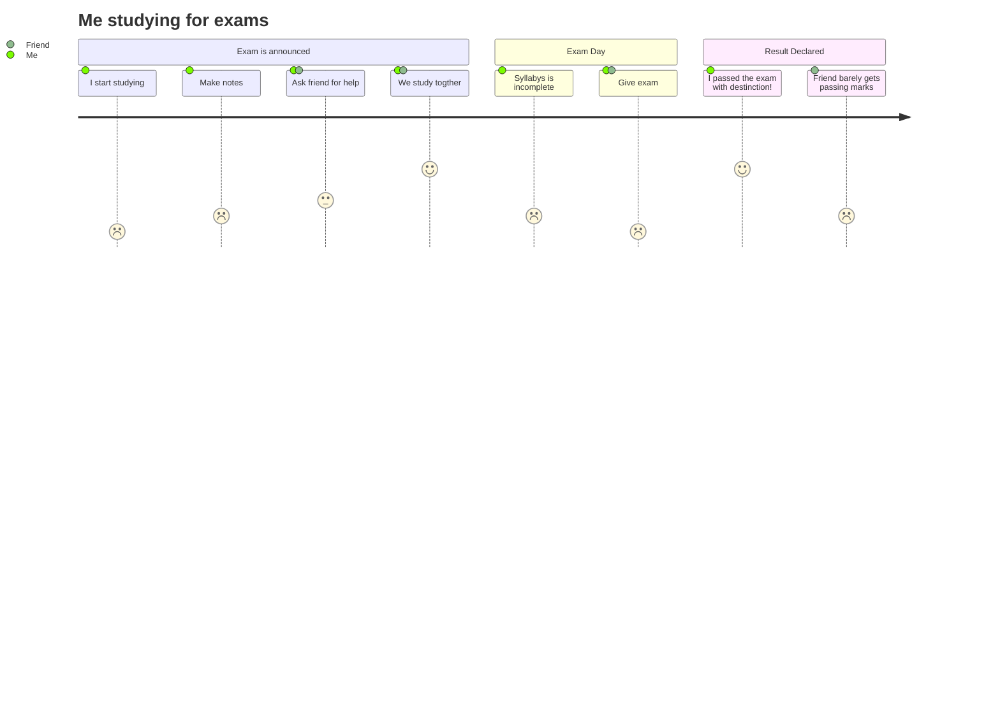

# Hello World 🌎


### Let's create a function that will control the computer's logic and give us back a string of choices ('r' or '-')
What will you call your function? Does it need any parameters? What will it return?


Your functions definition could look like this...
```python
def get_computer_choices(dice_list):
  pass
```





The Answer to the Great Question... 
Of Life, the Universe and Everything...
Is...
Forty-two.




